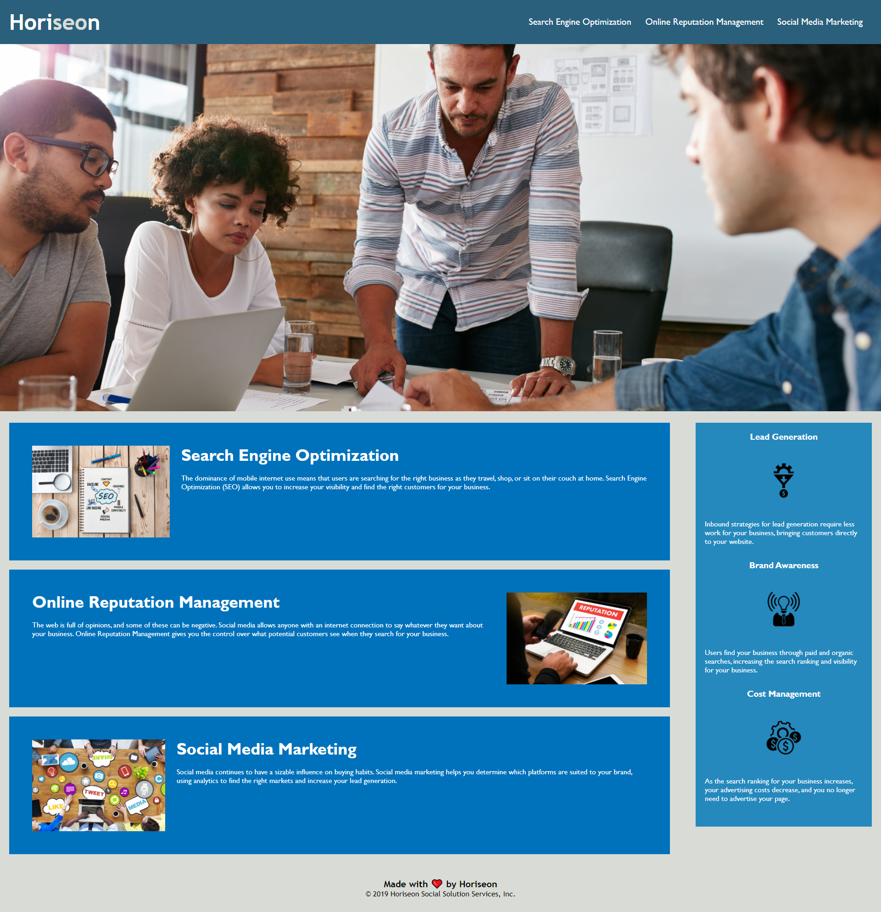

# Horiseon Social Solution Services, Inc

## Description
This is my Weekly Challenge #1 for my Coding Boot Camp class. The assignment was to refactor a code to meet the accptance criteria given. The code needed to meet the accessibility standards, have semantic HTML elements, alt attributes, a despcriptive title, fall in sequential order, and have a logical structure.

[Live URL](https://dmorgan904.github.io/search-horse/)

### Installation
1. Provided spacing to make the code easier to read. I also added comments to be able to easier see where a section end and begins.
2. Added semantic HTML elements throught the code.
3. Fixed the semantic HTML elements that I previously missed and edited the CSS to match.
4. The structure of the CSS was changed so that it would be in a logical order.
5. Reptitive code in CSS was deleted and class names were changed.
6. Alt attributes were added to all images.
7. Corrected the title element and corrected some spacing in the HTML.

### Usage
Horiseon is a marketing agency that helps companies with search engine optimization, online reputation management, and social media marketing. In layman's terms, Horiseon will help get a company or business more customers by increasing visibility. For example, if you are a new business owner and want to increase customer traffic, Horiseon will help.

### Credits
Original Creator of repo: [Xander Rapstine](http://www.rapstine.com/)
